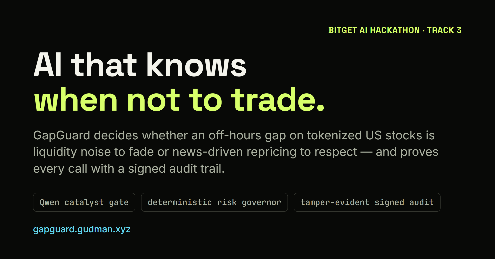
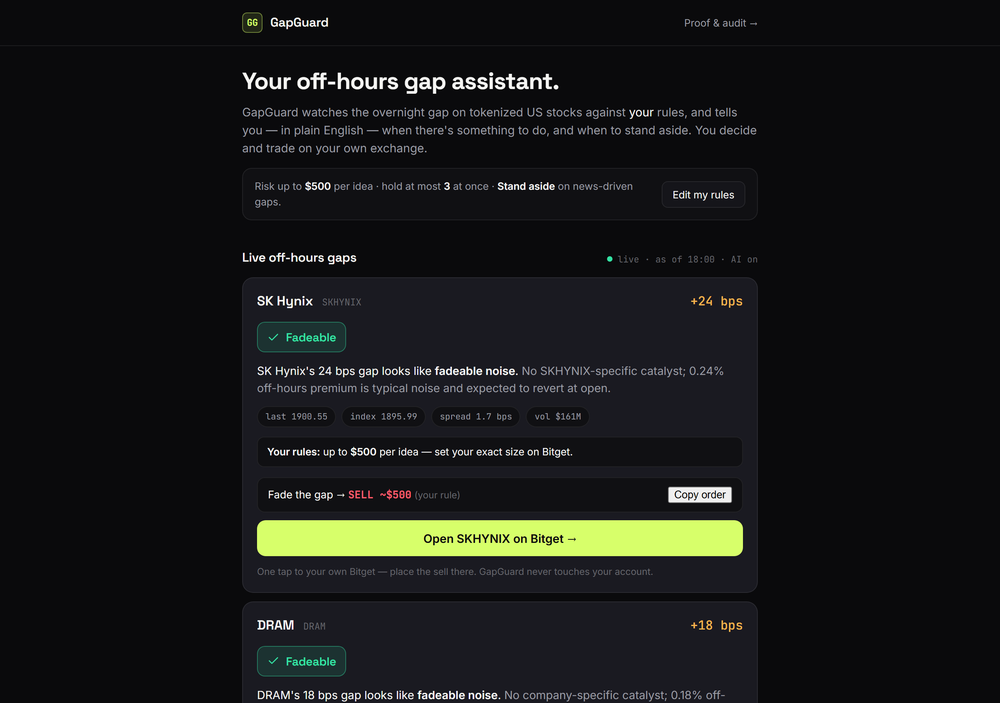
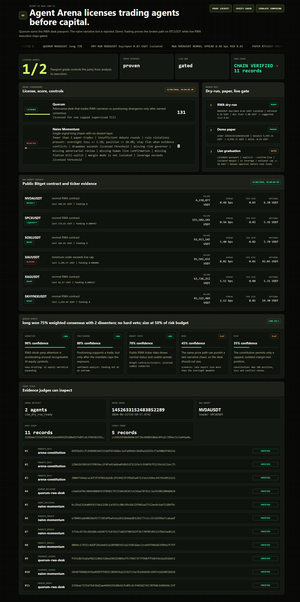
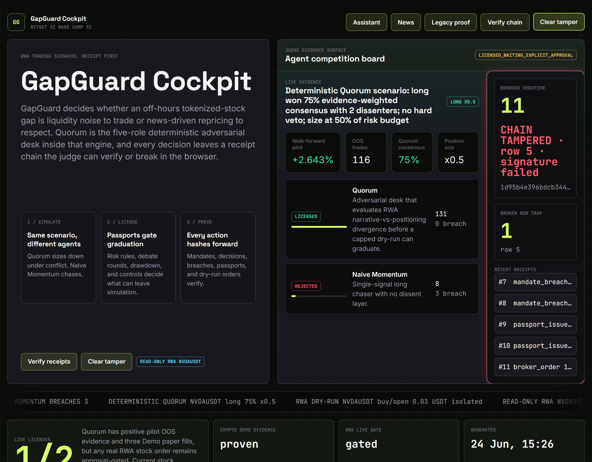

# GapGuard

[](https://gapguard.gudman.xyz)

GapGuard is an AI abstention and risk engine for tokenized US stocks: it decides whether an off-hours gap is liquidity noise to trade or news-driven repricing to respect, then proves every decision with a signed audit trail.

Bitget AI Base Camp Hackathon S1, Track 3: US Stock AI Trading.

**Live demo:** [gapguard.gudman.xyz](https://gapguard.gudman.xyz) &middot; **Video walkthrough:** [youtu.be/e_KX0ZDN2uw](https://youtu.be/e_KX0ZDN2uw)

<p align="center">
  
</p>

The consumer assistant ([`app.html`](https://gapguard.gudman.xyz/app.html)): plain-English off-hours gap calls scored against your own risk rules, with a one-tap handoff to your Bitget account. GapGuard gives the call and shows the exact order — it never holds your keys or places the trade.

## Track 3 Submission

Every required and supplementary material for Track 3 (US Stock AI Trading), mapped to where it lives. All links are public and require no login.

| Official requirement | Status | Where |
| --- | --- | --- |
| Public GitHub repo with README, **or** login-free demo | Both | This public repo + login-free demos: [`public/app.html`](public/app.html) (consumer assistant) and [`public/arena.html`](public/arena.html) (judge cockpit) |
| Live / paper trading log — timestamp, asset, direction, price, quantity, account balance change (required, prioritized) | Provided | [`artifacts/stock-paper-journal.jsonl`](artifacts/stock-paper-journal.jsonl) / [`.csv`](artifacts/stock-paper-journal.csv) — all six fields, AAPLUSDT/NVDAUSDT, plus PnL and a naive counterfactual |
| Backtest report with generating code, not screenshots (optional, supplementary) | Provided | `artifacts/*-backtest*.json` + [`playbook/aaplusdt-backtest-result.json`](playbook/aaplusdt-backtest-result.json); reproducible via `npm run backtest*` / `alpha:certify`, code in [`src/`](src) |
| Demo video, public, ≤3 min (optional) | Provided | [youtu.be/e_KX0ZDN2uw](https://youtu.be/e_KX0ZDN2uw) |
| Clear strategy thesis, not a feature list (required) | Provided | [How It Works](#how-it-works) below + the four-part write-up in [docs/SUBMISSION.md](docs/SUBMISSION.md) |

**Built with Bitget tools:** the AAPLUSDT managed backtest completed on Bitget Playbook and the strategy is **published** on GetAgent (`strategy fd237bfe-8c54-4a4a-b461-5188cc8e4d20`, version `0.0.1` — publicly listed, not just a private draft run; result in [`playbook/aaplusdt-backtest-result.json`](playbook/aaplusdt-backtest-result.json)), and the Bitget Agent Hub execution path is proven by a BTCUSDT Demo paper fill ([`artifacts/paper-btc-smoke.jsonl`](artifacts/paper-btc-smoke.jsonl)).

## 60-Second Quickstart

Requires Node.js >=20.

```bash
npm install
npm run judge
```

`npm run judge` rebuilds the stock paper journal, regenerates the Arena cockpit and evidence metrics, verifies `public/arena-chain.jsonl`, runs the readiness audit, serves `public/`, and opens the judge cockpit locally.

Manual checks:

```bash
npm run typecheck
npm test
npm run paper:journal
npm run evidence
npm run evidence:check
npm run verify-log -- public/arena-chain.jsonl
```

## Evidence

All public numbers below are generated from committed artifacts by `npm run evidence`. Full traceability lives in [docs/METRICS.md](docs/METRICS.md) and [public/metrics.json](public/metrics.json).

<!-- EVIDENCE:START -->
| Evidence | Current value | Source |
| --- | ---: | --- |
| AAPLUSDT always-fade baseline | -0.397% / 15 trades | `artifacts/aaplusdt-backtest.json` |
| AAPLUSDT always-follow baseline | -2.955% / 15 trades | `artifacts/aaplusdt-news-aware-backtest.json` |
| AAPLUSDT Qwen gate-driven pilot | +1.418% / 13 trades | `artifacts/aaplusdt-news-aware-backtest.json` |
| 20-symbol RWA always-fade baseline | -0.015% / 747 trades | `artifacts/rwa-multi-backtest.json` |
| Positive pilot OOS over 16 trading days | +2.643% / 116 trades | `artifacts/rwa-alpha-certification.json` |
| Multi-symbol gate holdout | 341 holdout candidates / 20 symbols | `artifacts/gate-holdout-report.json` |
| Risk-reduction edge: worst-case (p95) regret, gate vs always-fade | 5.807% vs 7.474% (reduction p=0.001) | `artifacts/gate-holdout-report.json` |
| Stock paper journal | 58 rows | `artifacts/stock-paper-journal.jsonl`, `artifacts/stock-paper-journal.csv` |
| Crypto Demo integration smoke | 3 BTCUSDT paper rows | `artifacts/paper-btc-smoke.jsonl` |
<!-- EVIDENCE:END -->

Boundary: cryptographic integrity proof, not regulatory certification. Approval-gated live path; current stock evidence is backtest/paper. The BTCUSDT Demo fill is a Bitget Demo integration smoke test, not Track 3 stock evidence.

Read the two regret rows together. The gate is deliberately **not** tuned for average accuracy — it slightly trails always-fade there (39.0% vs 42.2%), and the mean-regret gap is not significant (p = 0.106). A fade-everything bot looks accurate only because most gaps revert, while it quietly eats the rare news-day blowups. The significance-tested win is on **worst-case (p95) tail regret**, cut from 7.47% to 5.81% (p = 0.001): the engine trades a little average accuracy to avoid the disasters. That is exactly what "knows when not to trade" should buy — risk reduction, not a directional-alpha claim.

## How It Works

GapGuard is the product. Quorum is the internal five-role deterministic adversarial desk. Agent Passport/Arena is the trust and execution control layer.

1. Perception: Bitget RWA contract/ticker data, a deterministic US-session clock and dislocation logic, plus deterministic spread/depth/funding/NAV guards as a microstructure safety floor.
2. Catalyst gate: a two-tier Qwen model — `qwen3.6-flash` for quick passes, `qwen3.6-plus` for deep reasoning — classifies real, blinded Finnhub overnight news as fadeable noise or justified repricing. Invalid model output fails closed.
3. Quorum: five-role deterministic adversarial desk weighs narrative, positioning, market intel, bear, and risk evidence.
4. Mandate: natural-language risk rules compile into hard vetoes.
5. Execution: sim broker for RWA stock paper evidence; Agent Hub path proven on BTCUSDT Demo paper trading.
6. Proof: Arena records are sealed into a sha256 hash chain and signed with Ed25519 over a Merkle root.
7. Reflection: realized outcomes of past calls are appended to a hash-chained lesson log and fed back into the gate, so the engine learns from its own receipts without ever mutating them.

The [judge cockpit](https://gapguard.gudman.xyz/arena.html) recomputes every record hash in your browser. Change one row and the chain turns red — tamper-evident, and verifiable without trusting us.

<p align="center">
  
  &nbsp;&nbsp;
  
</p>

## Core Commands

```bash
npm run backtest         # AAPLUSDT deterministic always-fade baseline
npm run backtest:news    # cached Qwen gate-driven pilot + label baselines
npm run backtest:multi   # 20-symbol public Bitget RWA always-fade baseline
npm run alpha:certify    # walk-forward pilot artifact, not proof of live alpha
npm run paper:journal    # AAPLUSDT/NVDAUSDT stock paper journal, CSV + JSONL
npm run arena:cockpit    # public cockpit data, chain, and attestation
npm run rwa:check        # read-only public Bitget RWA market report
npm run news:feed        # server-side Finnhub refresh -> public/news-feed.json
```

Optional live Qwen regeneration:

```bash
BITGET_QWEN_API_KEY=<your-key> npm run gate:audit
```

Credentials stay in environment variables or ignored local files. Do not paste keys into chat or commit them.

## Live News Feed

`public/news.html` is a static read plane: it fetches only `public/news-feed.json` and never calls Finnhub or any exchange from the browser. Regenerate the feed server-side (never in the browser) with:

```bash
FINNHUB_API_KEY=<your-key> npm run news:feed
```

If the key tier lacks Finnhub's economic-calendar endpoint, the fetcher falls back to `data/macro-calendar.json`, labeled as a committed scheduled calendar.

## Important Files

- [public/arena.html](public/arena.html) - judge cockpit with in-browser chain verification and tamper simulation.
- [public/news.html](public/news.html) and [public/news-feed.json](public/news-feed.json) - static operational news surface and its server-generated feed.
- [public/arena-chain.jsonl](public/arena-chain.jsonl) - Arena-native tamper-evident records.
- [public/arena-attestation.json](public/arena-attestation.json) - Ed25519 attestation over the Arena Merkle root.
- [public/reflection-chain.jsonl](public/reflection-chain.jsonl) - append-only, hash-chained reflection lessons fed back into the gate.
- [artifacts/stock-paper-journal.jsonl](artifacts/stock-paper-journal.jsonl) and [artifacts/stock-paper-journal.csv](artifacts/stock-paper-journal.csv) - Track 3 stock paper journal.
- [artifacts/paper-btc-smoke.jsonl](artifacts/paper-btc-smoke.jsonl) - Bitget Demo integration smoke, BTCUSDT only.

## Honest Limits

- No live on-exchange RWA stock fill is claimed.
- The positive walk-forward result is a positive pilot OOS over 16 trading days, not proven profitable alpha.
- The 20-symbol always-fade basket is negative; the point of GapGuard is abstention, risk control, and verifiable restraint.
- Live real-money trading remains blocked without explicit user approval, a licensed passport, isolated margin, a hard notional cap, and `--confirm-live`.
- Microstructure fadeable probabilities are not yet calibrated: the spread/depth/funding/NAV guards run as a deterministic safety floor, and the calibration report honestly flags insufficient labeled history to fit a probabilistic model.

## Deep dives

- [docs/TRUST_LAYER.md](docs/TRUST_LAYER.md) — the portable seal → Merkle → Ed25519 → browser-verify attestation format, specified so any trading agent can reuse it.
- [docs/LIVE_RWA_RUNBOOK.md](docs/LIVE_RWA_RUNBOOK.md) — the safe, gated path to one real reversible RWA stock-perp fill sealed into the signed chain.
- [docs/SUBMISSION.md](docs/SUBMISSION.md) — full Track-3 write-up. [docs/METRICS.md](docs/METRICS.md) — every public number, traced to its artifact.
- [/status.html](https://gapguard.gudman.xyz/status.html) — live freshness watchdog for the cron-owned feeds and the gate key.

## License

MIT. See [LICENSE](LICENSE).
