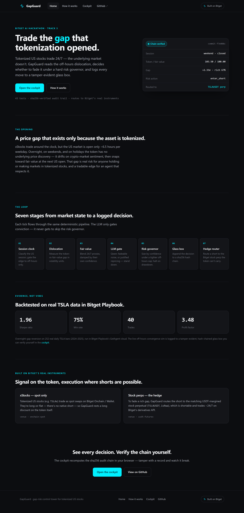
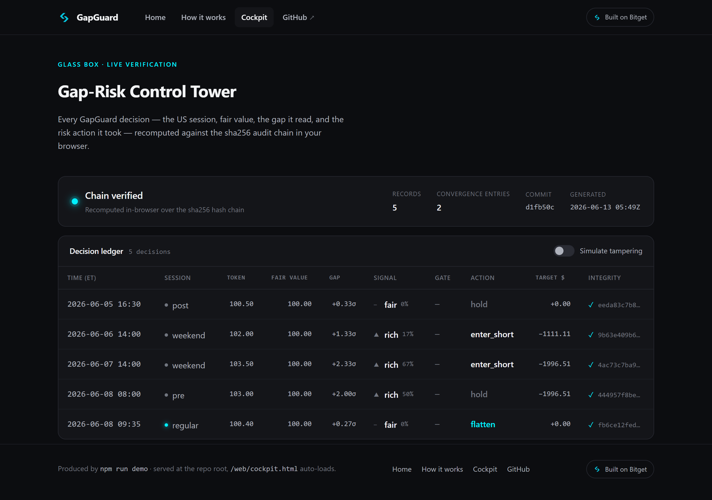

# GapGuard

A **gap-risk control tower for tokenized U.S. stocks** — built for the **Bitget AI Base Camp
Hackathon S1 — Track 3 (US Stock AI Trading)**. It watches session mismatch, estimates fair
value, asks an LLM whether a move is real news or noise, and produces a risk-governed
**hedge / reduce / trade / stand-down** decision with an auditable record.

## The problem (unique to tokenization)

Tokenized US stocks (xStocks) trade **24/7**, but the underlying US market is open only
~6.5h per weekday. Overnight, on weekends, and on holidays the token has **no underlying
price discovery** — it drifts on crypto-market liquidity and sentiment, then **snaps toward
fair value at the next US open**. GapGuard perceives that dislocation, decides whether to
fade it, reduce exposure, hedge, or stand down — under a hard risk governor — and logs every
decision as a glass-box audit trail.

This maps directly to the three Track-3 scoring criteria: a real problem in the tokenization
scenario, verifiable backtest/sim records, and use of Bitget's US-stock data/tools.

## Architecture

| Module | Role | Status |
| --- | --- | --- |
| `src/marketClock.ts` | Classifies the US session (regular/pre/post/overnight/weekend/holiday); `underlyingOpen` gates the edge; computes the next open. | ✅ built + tested |
| `src/nyseCalendar2026.ts` | Verified 2026 NYSE equity calendar (10 full closures + 2 early closes). | ✅ built |
| `src/dislocation.ts` | Estimates token vs fair-value gap in volatility units → `rich`/`cheap`/`fair` + confidence. | ✅ built + tested |
| `src/proxyReturn.ts` | Blends 24/7 signals (futures/sector-ETF tokens) into an implied underlying return that lifts fair value during off-hours. | ✅ built + tested |
| `src/riskGovernor.ts` | The differentiator: sizes by confidence/vol under a tighter off-hours cap, realizes into the reopen, halts on drawdown. | ✅ built + tested |
| `src/instruments.ts` + `src/hedgeRouter.ts` | Maps a decision to Bitget's real instruments: an xStock (`TSLAx`) is spot-only on Onchain, so a short routes to the matching USDT-M stock perp (`TSLAUSDT`); flags the off-hours perp-open caveat. | ✅ built + tested |
| `src/glassbox.ts` | Append-only JSONL audit trail, **sha256 hash-chained** (`prevHash`/`recordHash` + `verifyChain()`) so altering any past decision is detectable = the rubric's tamper-evident "verifiable usage record". | ✅ built + tested |
| `src/convergenceGate.ts` + `src/qwen.ts` | LLM gate (Qwen): classifies an off-hours gap as fadeable noise vs justified repricing, so the agent never fades real overnight news. | ✅ built + tested |
| Perception layer | Current perception = the `proxyReturn` blend + Qwen convergence gate. Designed to also consume Agent Hub macro/news Skills (`macro-analyst`, `news-briefing`, …) as gate context. | ✅ proxy + gate live · ⏳ Agent Hub context not yet wired |
| `playbook/` | Bitget Playbook package (Python/Nautilus): overnight-gap reversion on US-equity daily bars → PnL / drawdown / Sharpe. | ✅ uploaded + run; real TSLA metrics logged (Sharpe 1.96 / 75% win / 40 trades / PF 3.48) |

## Tooling (verified)

- **Agent Hub** (`bgc` CLI + `bitget-mcp-server`) — crypto-only market data + 5 analysis Skills. Perception brain.
- **Bitget Playbook** (`@bitget-ai/getagent-skill@0.2.1`) — US-stock quant backtest/deploy engine, driven from Claude Code.
- **Bitget instrument surface** — tokenized xStocks (`TSLAx`, …) are spot-only on Bitget Onchain/Wallet (long-or-flat); individual-stock USDT-M perps (`TSLAUSDT`, `productType=USDT-FUTURES`, `isRwa=YES`) are the shortable, ~24/7 hedge venue. GapGuard routes accordingly.

## Develop

```bash
npm install
npm test         # vitest — 37 tests
npm run typecheck
npm run demo     # replay a synthetic weekend-gap scenario end-to-end

# LLM convergence gate (Qwen). Needs the Bitget hackathon Qwen subsidy key:
BITGET_QWEN_API_KEY=<your-key> npm run gate-demo

npm run hedge-demo   # show how each decision routes to a Bitget instrument (token vs perp)
```

`npm run demo` runs the full loop (clock → dislocation → risk governor → glass-box) over a
synthetic TSLAx weekend: the token drifts rich while the market is closed, GapGuard fades the
convergence (here, a short under the off-hours cap), then flattens at the Monday reopen as price
snaps back. It charges a per-rebalance fee + slippage cost, prints a decision table, verifies the
glass-box hash chain, and writes the tamper-evident audit trail to `glassbox-demo.jsonl` (a header
line stamps the repo commit + run time, then one hash-chained JSONL record per decision).

## Website

`web/` is a zero-dependency static site: a landing page (`index.html`), an architecture
deep-dive (`how-it-works.html`), and the **cockpit** (`cockpit.html`) — a control-tower view of a
`glassbox-demo.jsonl` run that **re-verifies the sha256 hash chain in the browser** (SubtleCrypto).
A "Simulate tampering" toggle flips a value live so you can watch the verification turn red.

```bash
npm run demo                 # produces glassbox-demo.jsonl
python -m http.server 8080   # serve the repo root → http://localhost:8080/web/
# the cockpit auto-loads the log; or open web/cockpit.html and drag the .jsonl in (works from file://)
```



